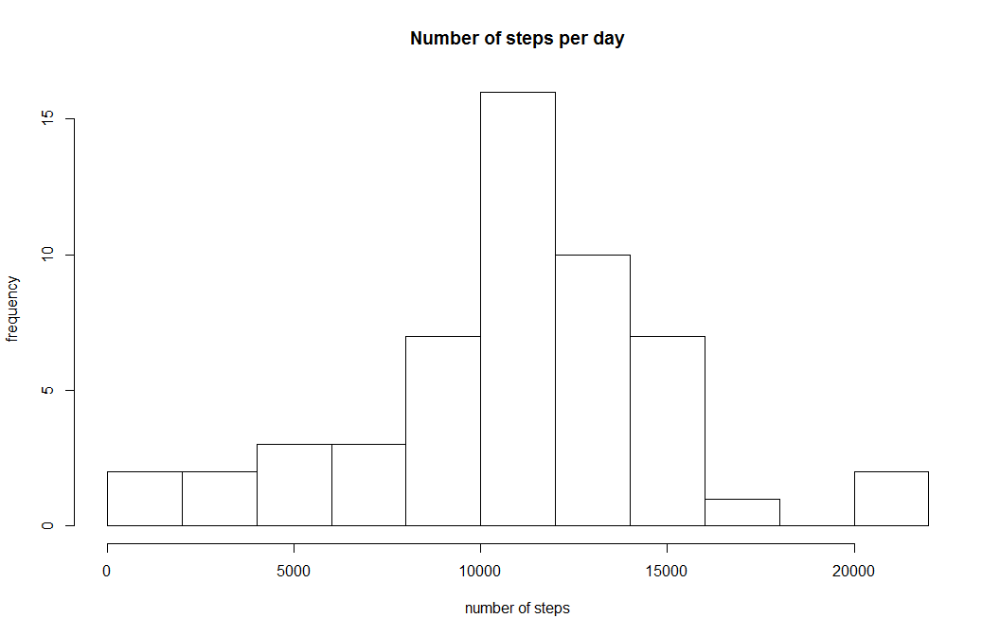
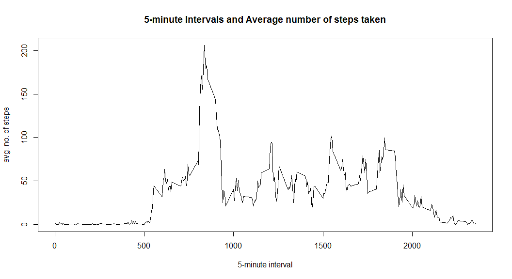
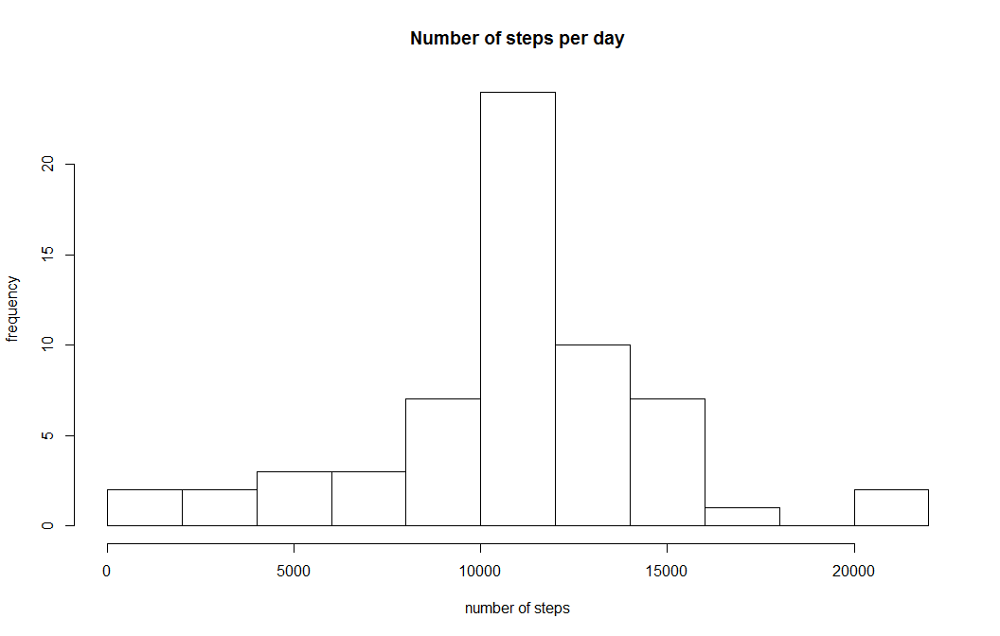
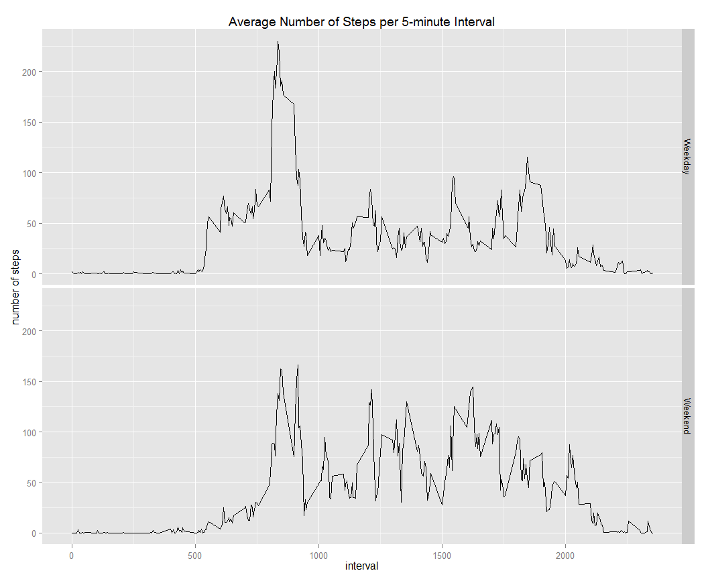

# Reproducible Research: Peer Assessment 1

## Introduction

It is now possible to collect a large amount of data about personal movement using activity monitoring devices such as a Fitbit, Nike Fuelband, or Jawbone Up. These type of devices are part of the “quantified self” movement – a group of enthusiasts who take measurements about themselves regularly to improve their health, to find patterns in their behavior, or because they are tech geeks. But these data remain under-utilized both because the raw data are hard to obtain and there is a lack of statistical methods and software for processing and interpreting the data.

This assignment makes use of data from a personal activity monitoring device. This device collects data at 5 minute intervals through out the day. The data consists of two months of data from an anonymous individual collected during the months of October and November, 2012 and include the number of steps taken in 5 minute intervals each day.

## Data

The data for this assignment can be downloaded from the course web site:

- *Dataset*: [Activity monitoring data]("https://d396qusza40orc.cloudfront.net/repdata%2Fdata%2Factivity.zip") [52K]

The variables included in this dataset are:

- *steps*: Number of steps taking in a 5-minute interval (missing values are coded as NA)

- *date*: The date on which the measurement was taken in YYYY-MM-DD format

- *interval*: Identifier for the 5-minute interval in which measurement was taken

The dataset is stored in a comma-separated-value (CSV) file and there are a total of 17,568 observations in this dataset.

-----

# The Project

Now, let's load the data and try to answer some questions regarding the previously referred data. 

## 

## Loading and preprocessing the data

1. First, let's unzip the file and list the files.


```r
unzip("activity.zip", list=TRUE)
```

```
##           Name Length                Date
## 1 activity.csv 350829 2014-02-11 10:08:00
```

```r
unzip("activity.zip")
```

2. Now, let's load the file and set the right formats.


```r
df <- read.csv("activity.csv", header = TRUE)
df$date <- as.Date(df$date)
```

## What is mean total number of steps taken per day?

1. There are several ways of computing the mean per day.
We can use the `ddply` function of the `plyr` package. 


```r
library(plyr)
# as asked for this question, we omit NAs first
clean.df <- na.omit(df)
ddply(clean.df, .(date), summarize, "mean"= mean(steps), "median" = median(steps), .drop = TRUE)
```

```
##          date    mean median
## 1  2012-10-02  0.4375      0
## 2  2012-10-03 39.4167      0
## 3  2012-10-04 42.0694      0
## 4  2012-10-05 46.1597      0
## 5  2012-10-06 53.5417      0
## 6  2012-10-07 38.2465      0
## 7  2012-10-09 44.4826      0
## 8  2012-10-10 34.3750      0
## 9  2012-10-11 35.7778      0
## 10 2012-10-12 60.3542      0
## 11 2012-10-13 43.1458      0
## 12 2012-10-14 52.4236      0
## 13 2012-10-15 35.2049      0
## 14 2012-10-16 52.3750      0
## 15 2012-10-17 46.7083      0
## 16 2012-10-18 34.9167      0
## 17 2012-10-19 41.0729      0
## 18 2012-10-20 36.0938      0
## 19 2012-10-21 30.6285      0
## 20 2012-10-22 46.7361      0
## 21 2012-10-23 30.9653      0
## 22 2012-10-24 29.0104      0
## 23 2012-10-25  8.6528      0
## 24 2012-10-26 23.5347      0
## 25 2012-10-27 35.1354      0
## 26 2012-10-28 39.7847      0
## 27 2012-10-29 17.4236      0
## 28 2012-10-30 34.0938      0
## 29 2012-10-31 53.5208      0
## 30 2012-11-02 36.8056      0
## 31 2012-11-03 36.7049      0
## 32 2012-11-05 36.2465      0
## 33 2012-11-06 28.9375      0
## 34 2012-11-07 44.7326      0
## 35 2012-11-08 11.1771      0
## 36 2012-11-11 43.7778      0
## 37 2012-11-12 37.3785      0
## 38 2012-11-13 25.4722      0
## 39 2012-11-15  0.1424      0
## 40 2012-11-16 18.8924      0
## 41 2012-11-17 49.7882      0
## 42 2012-11-18 52.4653      0
## 43 2012-11-19 30.6979      0
## 44 2012-11-20 15.5278      0
## 45 2012-11-21 44.3993      0
## 46 2012-11-22 70.9271      0
## 47 2012-11-23 73.5903      0
## 48 2012-11-24 50.2708      0
## 49 2012-11-25 41.0903      0
## 50 2012-11-26 38.7569      0
## 51 2012-11-27 47.3819      0
## 52 2012-11-28 35.3576      0
## 53 2012-11-29 24.4688      0
```

2. Now let's see a histogram to better analyze the information about the total number of steps per day.


```r
tmp <- ddply(clean.df, .(date), summarize, "sum"= sum(steps), .drop = TRUE)
hist(tmp$sum, xlab = "number of steps", ylab="frequency", main="Number of steps per day", breaks=15)
```

 

## What is the average daily activity pattern?

1. Let's makek a plot of the 5-minute interval (x-axis) and the average number of steps taken, averaged across all days (y-axis).


```r
df.avg <- aggregate(clean.df$steps, by=list(clean.df$interval),  data = df, FUN = mean)
plot(df.avg$Group.1, df.avg$x, type="l", xlab="5-minute interval", ylab="avg. no. of steps", 
     main="5-minute Intervals and Average number of steps taken")
```

 

2. Let's find out which interval, on average across all the days in the dataset, contains the maximum number of steps.
Since each interval is of 5 minutes, let's find out what time of the day this interval corresponds to.


```r
max <- df.avg$Group.1[df.avg$x==max(df.avg$x)]
max
```

```
## [1] 835
```

```r
print(paste("Which corresponds to ", max%/%60, "hors and", max%%60, "minutes"))
```

```
## [1] "Which corresponds to  13 hors and 55 minutes"
```


## Imputing missing values

1. Let's find out how many NAs values there are in the original data frame (remember, `clean.df` contains the values without NAs, and `df` contains all the original values).


```r
length(df[is.na(df)])
```

```
## [1] 2304
```

2. Since there are some missing values, let's assign the mean of each 5-minute interval as a default value for those missing values.

We will create a new dataset that is equal to the original dataset but with the missing data filled in.

In the data frame `df.avg` we already have the average per interval across all days.
We just need to find all the `NA` values and replace them by the corresponding average calculated in the data frame `df.avg`.


```r
for(i in 1:nrow(df)) {
    if (is.na(df[i,1]) == TRUE) {
      df[i,1] <- df.avg[df.avg$Group.1 == df[i,3],2]
    }
}
```

3. Now, let's make a histogram with these new values.


```r
tmp2 <- ddply(df, .(date), summarize, "sum"= sum(steps), .drop = TRUE)
hist(tmp2$sum, xlab = "number of steps", ylab="frequency", main="Number of steps per day", breaks=15)
```

 

4. Now let's calculate the mean and the median for the total number of steps taken per day, again using the data frame where the `NA` values were replaced by its respective mean.


```r
ddply(df, .(date), summarize, "mean"= mean(steps), "median" = median(steps), .drop = TRUE)
```

```
##          date    mean median
## 1  2012-10-01 37.3826  34.11
## 2  2012-10-02  0.4375   0.00
## 3  2012-10-03 39.4167   0.00
## 4  2012-10-04 42.0694   0.00
## 5  2012-10-05 46.1597   0.00
## 6  2012-10-06 53.5417   0.00
## 7  2012-10-07 38.2465   0.00
## 8  2012-10-08 37.3826  34.11
## 9  2012-10-09 44.4826   0.00
## 10 2012-10-10 34.3750   0.00
## 11 2012-10-11 35.7778   0.00
## 12 2012-10-12 60.3542   0.00
## 13 2012-10-13 43.1458   0.00
## 14 2012-10-14 52.4236   0.00
## 15 2012-10-15 35.2049   0.00
## 16 2012-10-16 52.3750   0.00
## 17 2012-10-17 46.7083   0.00
## 18 2012-10-18 34.9167   0.00
## 19 2012-10-19 41.0729   0.00
## 20 2012-10-20 36.0938   0.00
## 21 2012-10-21 30.6285   0.00
## 22 2012-10-22 46.7361   0.00
## 23 2012-10-23 30.9653   0.00
## 24 2012-10-24 29.0104   0.00
## 25 2012-10-25  8.6528   0.00
## 26 2012-10-26 23.5347   0.00
## 27 2012-10-27 35.1354   0.00
## 28 2012-10-28 39.7847   0.00
## 29 2012-10-29 17.4236   0.00
## 30 2012-10-30 34.0938   0.00
## 31 2012-10-31 53.5208   0.00
## 32 2012-11-01 37.3826  34.11
## 33 2012-11-02 36.8056   0.00
## 34 2012-11-03 36.7049   0.00
## 35 2012-11-04 37.3826  34.11
## 36 2012-11-05 36.2465   0.00
## 37 2012-11-06 28.9375   0.00
## 38 2012-11-07 44.7326   0.00
## 39 2012-11-08 11.1771   0.00
## 40 2012-11-09 37.3826  34.11
## 41 2012-11-10 37.3826  34.11
## 42 2012-11-11 43.7778   0.00
## 43 2012-11-12 37.3785   0.00
## 44 2012-11-13 25.4722   0.00
## 45 2012-11-14 37.3826  34.11
## 46 2012-11-15  0.1424   0.00
## 47 2012-11-16 18.8924   0.00
## 48 2012-11-17 49.7882   0.00
## 49 2012-11-18 52.4653   0.00
## 50 2012-11-19 30.6979   0.00
## 51 2012-11-20 15.5278   0.00
## 52 2012-11-21 44.3993   0.00
## 53 2012-11-22 70.9271   0.00
## 54 2012-11-23 73.5903   0.00
## 55 2012-11-24 50.2708   0.00
## 56 2012-11-25 41.0903   0.00
## 57 2012-11-26 38.7569   0.00
## 58 2012-11-27 47.3819   0.00
## 59 2012-11-28 35.3576   0.00
## 60 2012-11-29 24.4688   0.00
## 61 2012-11-30 37.3826  34.11
```

Clearly, after we replaced the missing values with the mean of the 5-minutes interval, the mean, median, and the histogram are  not the same. 
This is because before, with the cleaned values, the `NA` values were not taken into account. However, all those values are now replaced by its respective mean, and thus **the total daily number of steps increases**.

## Are there differences in activity patterns between weekdays and weekends?

1. First, let's create a new factor variable in the dataset with two levels -- "weekday" and "weekend" indicating whether a given date is a weekday or weekend day.


```r
df$tday <- as.factor(ifelse(weekdays( df$date) %in% c("Saturday","Sunday"), "Weekend", "Weekday"))
```

2. Now, let's make a panel plot of the 5-minute interval (x-axis) and the average number of steps taken, averaged across all weekday days or weekend days (y-axis). 


```r
df.avg2 <- aggregate(df$steps, by=list(df$interval,df$tday),  data = df, FUN = mean)
library(ggplot2);
qplot(Group.1, x, data=df.avg2, facets = Group.2~., geom = "line",
      xlab = "interval", ylab = "number of steps", 
      main = "Average Number of Steps per 5-minute Interval");
```

 


